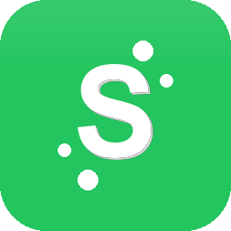

<div align="center">
  
  <h1>Synapse Healthcare MIS</h1>
  <p><b>An all-in-one Healthcare and Lifestyle Management Ecosystem</b></p>
</div>

---

## 🌟 About Synapse

**Synapse** is an intuitive, open-source personal health management desktop application built using JavaFX. Designed with a user-centric approach, it empowers you to take control of your daily well-being by seamlessly tracking vitals, logging symptoms, managing medications, and maintaining a dietary journal. Whether you're monitoring daily lifestyle habits or generating clinical PDF reports for your next doctor's visit, Synapse seamlessly bridges the gap between personal health tracking and professional care.

## ✨ Key Features

- **❤️ Vitals Logging:** Track essential health metrics including blood pressure, heart rate, and body temperature. The system automatically detects anomalies and alerts you to abnormal readings.
- **🔍 Symptom Tracking:** Log recurring symptoms along with their severity levels to monitor health patterns over time.
- **💊 Medicine Management:** Effortlessly manage your medicine inventory, set precise dosage schedules, and check for potential drug interactions.
- **🥗 Diet & Hydration:** Maintain a daily log of meals, track caloric intake, and monitor daily water consumption goals.
- **📓 Health Journal:** Document daily reflections and track your mood for mental well-being.
- **📅 Medical Calendar:** Schedule, manage, and keep track of critical health events and medical appointments.
- **🏥 Hospital Directory:** Locate nearby healthcare facilities utilizing built-in directory data.
- **🚨 Emergency Profile:** Quickly access critical identifiers such as blood type, allergies, chronic conditions, and emergency contacts. Includes a robust "Emergency SOS" PDF export functionality.
- **📁 Medical Records:** Securely upload, organize, and store your essential medical files within the application.
- **📊 Analytics Dashboard:** Visualize your health trends and progress with highly interactive and responsive charts.
- **📋 PDF Health Reports:** Generate comprehensive, cleanly formatted clinical PDF reports for doctor visits, powered by IronPDF with a reliable Apache PDFBox fallback.
- **☁️ Backup & Restore:** Export and import your data seamlessly via JSON format to ensure data safety and portability.
- **🌓 Adaptive Interface:** Features a beautifully designed UI with a toggleable modern dark mode for enhanced user experience.

## 🛠️ Technology Stack

- **UI Framework:** JavaFX 17 (Custom CSS styling)
- **Database:** H2 Embedded Database (Portable, requires no separate installation)
- **ORM:** Hibernate 6.4 + Jakarta Persistence (JPA)
- **PDF Generation:** IronPDF & Apache PDFBox
- **Build Tool:** Maven (Java 17)

## 🚀 Getting Started

Follow these detailed instructions to set up and run Synapse locally on your machine.

### Prerequisites

Ensure you have the following installed on your system:
- **Java Development Kit (JDK) 17** or higher
- **Apache Maven 3.9** or higher
- **Git** (for version control)

### 1. Clone the Repository

Begin by cloning the Synapse repository to your local machine:

```bash
git clone https://github.com/Raja-Shehryar-Ameer/Synapse-MIS.git
cd Synapse-MIS
```

### 2. Build the Project

Use Maven to resolve dependencies and build the project. Run the following command in the root directory:

```bash
mvn clean install
```

### 3. Run the Application Locally

You can launch the application directly via the Maven JavaFX plugin:

```bash
mvn javafx:run
```

Alternatively, if you have packaged the application into a JAR file, you can run it using:

```bash
java -jar target/Synapse-1.0-SNAPSHOT.jar
```

### 4. Database Configuration

By default, Synapse is configured to use a portable **H2 Embedded Database** located at `synapse-data/synapse-db`. This means your data is stored locally within the application folder and requires zero external setup.

If you wish to switch to a standalone SQL Server database for production or centralized deployment:
1. Open `src/main/resources/META-INF/persistence.xml`.
2. Modify the persistence unit to utilize the `synapse-sql-pu` configuration.
3. Ensure your SQL Server instance is running and update the connection credentials accordingly.

## 📦 Download / Installation (Windows)

You do not need to have Java installed to run Synapse! A standalone Windows `.exe` installer is provided which includes a bundled Java Runtime Environment.

**To install Synapse via the executable:**
1. Navigate to the **Releases** page of this repository.
2. Download the latest `Synapse-Setup.exe` file from the **Assets** section.
3. Double-click the downloaded `.exe` to initiate the installation and launch the application.

## 🤝 Contributing

Contributions are welcome! If you would like to contribute to Synapse, please fork the repository and submit a pull request with your proposed changes. Ensure that your code adheres to the existing style guidelines and includes appropriate tests.

## 📄 License

This project is open-source and available under the [MIT License](LICENSE).
